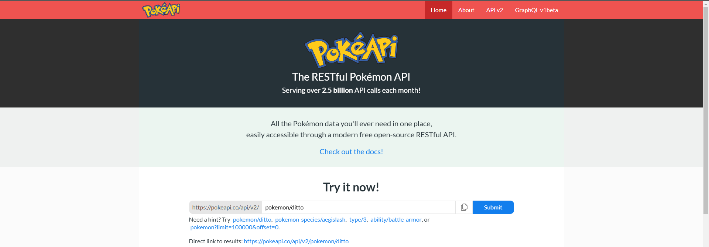
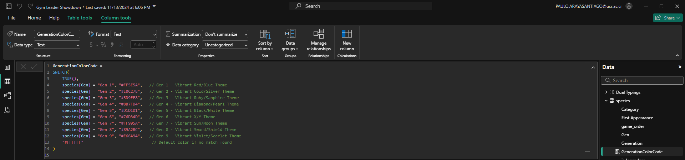
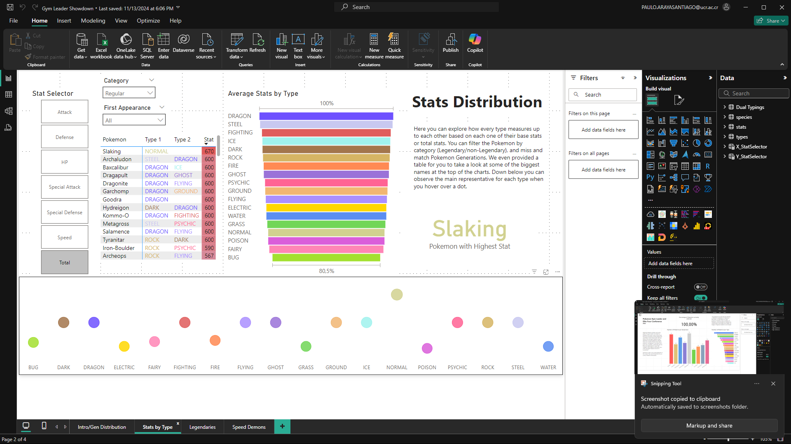
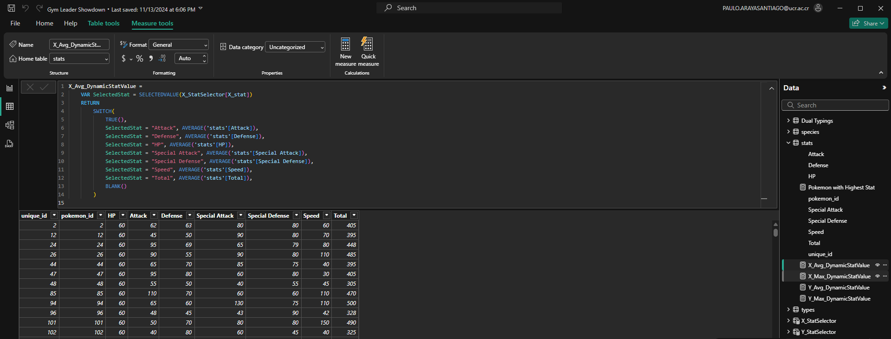

# Pokémon Database Analysis and Visualization Project

This repository documents a comprehensive end-to-end workflow for extracting, transforming, and analyzing Pokémon datasets sourced from the [PokeAPI](https://pokeapi.co/). It integrates Python-based data ingestion, relational database normalization in SQL Server and PostgreSQL, and advanced visualization techniques in Power BI. The following narrative and inlined images illustrate each stage of the pipeline with technical rigor.

## Overview

The objective is to operationalize raw, nested JSON data into a high-quality, analytics-ready schema. Subsequently, Power BI dashboards leverage dynamic DAX measures and modeling techniques to deliver interactive insights—ranging from generational distributions and type-based performance metrics to identifying standout Pokémon by custom-defined criteria.

## Data Extraction and Transformation

Extraction initiates from the PokeAPI, where a RESTful endpoint provides hierarchical Pokémon data:

Representative JSON structures demonstrate the complexity of the data model:

These hierarchical formats necessitate a structured flattening procedure:

A Python script orchestrates data retrieval and parsing:

Custom Python functions transform the nested JSON payloads into normalized pandas DataFrames, ensuring columnar integrity and facilitating subsequent database ingestion:

## Relational Database Design and Management

Upon successful extraction and restructuring, the data is ingested into SQL Server Management Studio (SSMS). The schema creation process establishes relational integrity and normalization:

The resulting schema is visible in SSMS, reflecting a fully normalized relational database with distinct tables for species, stats, and types:

Data cleansing and transformation occur at the relational layer. Statistics and types undergo refinement to ensure consistent data domains and removal of anomalies:

  

Post-transformation, the types table is fully integrated, consolidating primary and secondary type assignments:

Advanced SQL techniques, including window functions, remove duplicates and standardize species entries:

By joining these refined tables, a unique key dataset emerges, forming the basis for advanced analytics:

The clean, conformed datasets are then migrated to PostgreSQL to ensure scalability and seamless integration with modern analytics engines:

## Power BI Visualization and Analytical Layer

With a stable, high-quality dataset established, Power BI is employed to model relationships and craft interactive visualizations. A dual typings table aligns Pokémon IDs to multiple type attributes, enabling category-based segmentation and color encoding:

DAX measures introduce dynamic color assignments based on generation and type categories, enhancing visual differentiation:

Initial dashboards offer a navigational framework, highlighting generational distributions, type frequencies, and user guidance:

Subsequent visualizations isolate critical insights, such as Legendary vs. regular distributions across generations, employing line charts, pie charts, and slicers to facilitate user-driven exploration:

Advanced DAX measures enable responsive analytics. The following calculation dynamically identifies the top-performing Pokémon for any selected stat:

A robust data model ensures referential integrity and seamless interactivity:

The raw species table is directly accessible within Power BI, serving as a lookup for generational and categorical views:

## Advanced Analytics and Custom Measures

Deeper analyses segment and compare stats by Pokémon type. For example, average and maximum metrics can be dynamically computed and filtered:

Tailored DAX measures pinpoint outliers, such as the strongest Pokémon by primary type:

Focus on specific attributes, like speed, with treemaps and bar charts that uncover evolutionary advantages and generational shifts:

Dynamic measures allow metric switching (e.g., average vs. max) along multiple axes, empowering complex comparative analyses:

A stat selection table enables on-the-fly comparisons, turning a static report into an interactive analytical tool:

## Technologies Utilized

- **Python (requests, pandas)**: Hierarchical data ingestion and flattening for database entry.
- **SQL Server Management Studio & PostgreSQL**: DDL, DML, and data normalization for enterprise-grade data warehousing.
- **Power BI with DAX**: Interactive dashboards, advanced calculation logic, and dynamic visuals.

## Getting Started

1. **Extract & Transform Data**: Run the Python scripts to query PokeAPI endpoints and produce normalized DataFrames.
2. **Build the Schema & Load Data**: Execute the SQL DDL and DML scripts within SSMS or PostgreSQL, ensuring schema creation and data insertion.
3. **Analyze & Visualize**: Open the Power BI report, interact with slicers, adjust stat measures, and derive insights from the dynamic visualizations.

This project demonstrates a robust data engineering and analytics workflow, leveraging modern tools and techniques to produce an integrated, end-to-end solution for exploring complex Pokémon datasets.
